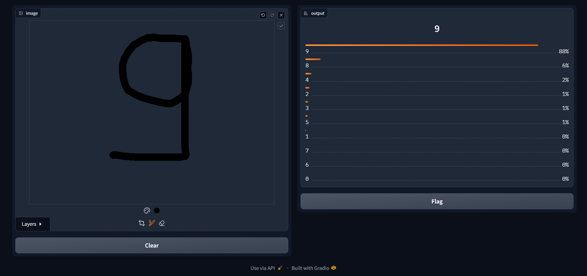

# HandWritten-Digit Recognition

This project aims to create a digit recognition system using TensorFlow for training a convolutional neural network (CNN) model and Gradio for creating a user-friendly interface. The trained model can recognize hand-drawn digits ranging from 0 to 9 with high accuracy.
## Files Included


- **digit-recognition.ipynb**: This notebook contains the code for training the CNN model using the MNIST dataset, saving the trained model, and evaluating its performance.
- **interface.ipynb**: This notebook includes the code for setting up a Gradio interface where users can draw digits, and the trained model predicts the digit.

## Installation

Clone the project

```bash
  git clone https://github.com/Shreyasb1015/HandWritten-Digit-Recognition
```

Go to the project directory

```bash
  cd HandWritten-Digit-Recognition

```

Install dependencies

```bash
  pip install tensorflow gradio
```


## Implementation Examples




